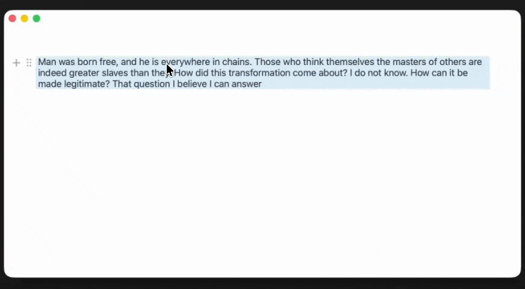
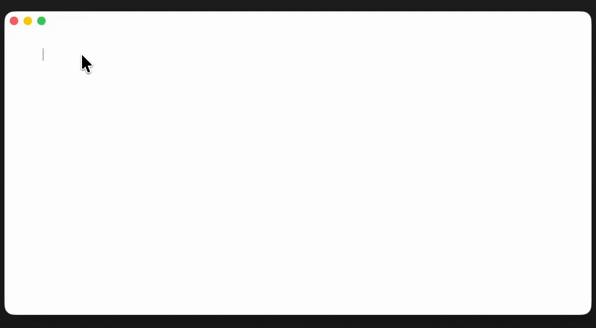
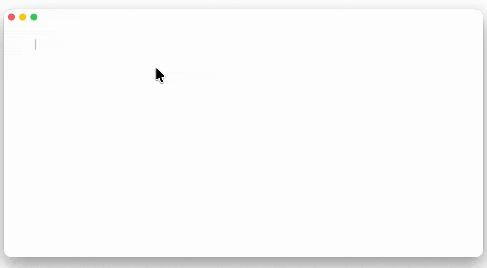
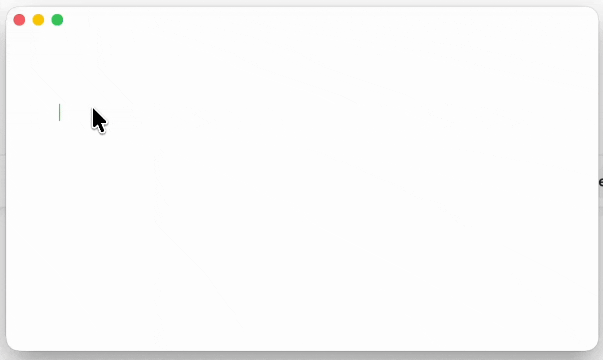

# textytext

Textytext is a native MacOS rich text editor with UX similar to Notion. I.e. a block-based text editor which supports several block types, including text, header, image, code snippet, bullet list, and numbered list.

The text editor is written entirely in Swift with AppKit, and then wrapped in a NSViewControllerRepresentable so you can render the text editor as a SwiftUI component like this:

```swift
import SwiftUI

struct EditorContainer: View {
    var body: some View {
        TextViewContainer()
    }
}
```

# Functionality

### Basic text editing


### Lists (bullet & numbered)


### Images


### Code snippets


### Links


### And more

Also supported:
- copying and pasting text from various different sources (HTML, PDF, plain text)

# About this repo

This text editor was created in 2023 in connection with an app that I didn't complete. I haven't updated anything since then, so it's current as of MacOS 13.0 and Swift 5, but the app still works on the latest MacOS (26.2).

How this can be used by other people:
- If you intend to create a native MacOS application that would benefit from having a block-based rich text editor, you can take this code and adapt it to your app. You'll have to do a bit of work, the code is slightly spaghetti and hasn't received any love in 3 years. Nonetheless, it would be a good starting point. Building this from scratch is arduous.
- Contributors can turn it into an open source rich text editor for MacOS, like [Blocknote](https://www.blocknotejs.org/) is for the web.
